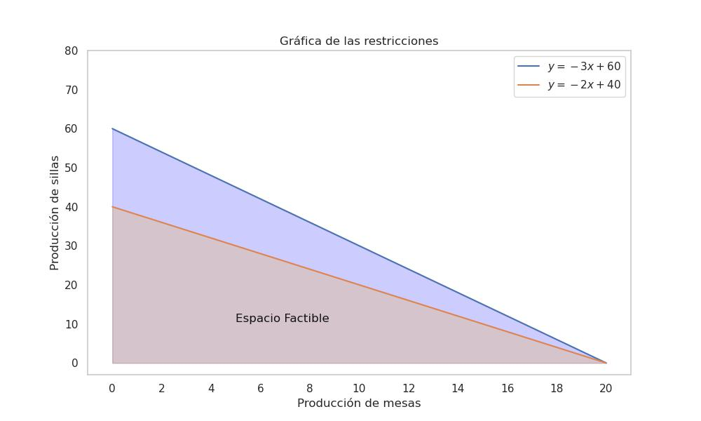
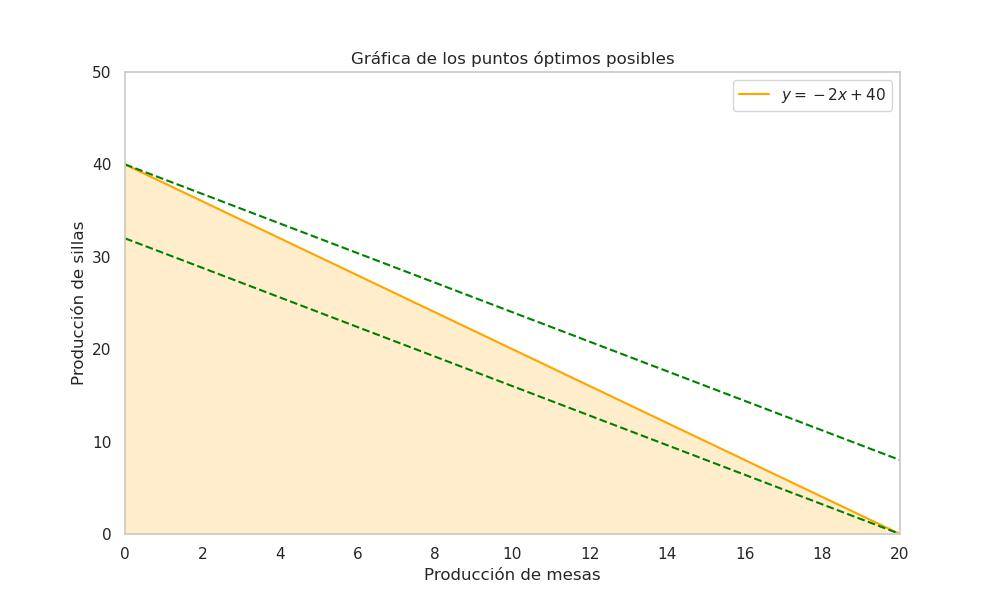

Se llama programación líneal porque:

* Las restricciones son lineales

Para poder tener un mayor entendimiento de qué es programación líneal, tendremos en cuenta el siguiente ejemplo.

> [!example]
> Una compañia de fabricación de muebles produce mesas y sillas. Cada mesa requiere 3 horas de trabajo en el taller de carpintería y 2 horas de trabajo en el taller de acabado. Cada silla requiere 1 hora de trabajo en el taller de carpintería y 1 hora ede trabajo en el taller de acabado. El taller  de carpintería tiene disponible un máximo de 60 horas por semana, y el taller de acabado tiene disponible un máximo de 40 horas por semana. 
> 
> Cada mesa se vende por $\$80$ y cada silla se vende por $\$50$. La compañia desea maximizar sus ingresos semanales.

### Identificación del contenido

Como vimos en el capítulo [1. Introducción a la optimización](1.%20Introducción%20a%20la%20optimización.md) es útil definir la línea de vida del proceso a optimizar, para ello identificaremos claramente las partes que componen el problema en tres aspectos principales.

>[!abstract]
>
>La información sustancial que el enunciado nos transmite se puede ver reflejada en las siguientes tablas
>
>| - | Tiempo Carpintería | Tiempo Acabado |
>| :-- | :--: | :--: |
>| Mesa              | 3              | 2         |
>| Silla             | 1              | 1         |
>| Tiempo Disponible | $\leq 60$      | $\leq 40$ |
>
>| Producto | Costo unitario |
>| :------- | -------------- |
>| Mesa     | $\$80$         |
>| Silla    | $\$50$         |

> [!info] 
> 
> Nuestro **función objetivo** se basa en la función para calcular ingresos, la cual tiene la forma $\text{costo unitario} \times \text{unidades producidas}$, lo cual adaptado a nuestro problema se vería de la siguiente forma.
> $$I = 80x + 50y$$
> Por otro lado, nuestras  **variables de desición** las podemos definir de la siguiente manera:
> 
> $x \rightarrow \text{ Mesa}$
> $y \rightarrow \text{ Silla}$

> [!warning]
> 
> Contamos con 3 restricciones sobre este problema, las cuales son las siguientes:
> 
> * $3x + y \leq 60 \text{ Tiempo Carpintería}$
> * $2x + y \leq 40 \text{ Tiempo Acabado}$
> * $x,y \geq 0 \text{ No negatividad}$

Una vez habiendo identificado las diferentes partes del problema es necesario establecer nuestro espacio factible, para ello necesitamos contruir las rectas asociadas a las restricciones.

Este proceso se realiza considerando cada restricción como una igualdad en vez de una desigualdad. Después de considerar la ecuación como una igualdad, procede a despejar alguna de la variable de desición $y$, quedando con las siguientes igualdades.

$$y = -3x + 60$$$$y = -2x + 40$$
En la gráfica inferior podemos visualizar las rectas que delimitan las restricciones y bajo la recto el área asociada a la restricción. Es espacio factible es aquel donde él área de las restricciones se intersectan, en este caso el área con tonalidades rojas

> [!important]
> 
> Es importante tener en cuenta que considerar la ecuación como una igualdad es útil **solo** para poder hallar las rectas de restricción.

El siguiente paso para poder determinar el punto máximo es despejar la variable $y$ de la función objetivo $I = 80x + 50y$, para este paso la variación con el punto de corte del eje $y$ es importante y debe tener en cuenta que todas las rectas con diferente punto de corte **serán paralelas**.

Los puntos óptimos posibles son aquellos vértices de intersección de las funciones, en este caso los puntos $(0,40)$ y $(20,0)$. Cabe aclarar que por lo general *(y teniendo en cuenta que es una visualización 2D)* los valores máximos o mínimos no se encuentran dentro del área, si no en sus extremos.

El último paso para determinar cuál de los puntos genera mayor ingresos semanales, es evaluar ambos puntos en la función objetivo y determinar cual de los dos es mayor.

$$I(x,y) = 80x + 50y \quad\Box\quad I(x,y) = 80x + 50y $$
$$I(20,0) = 80\cdot20 + 50\cdot0 \quad\Box\quad I(0,40) = 80\cdot0 + 50\cdot40 $$
$$I(20,0) = 1600 \quad\Box\quad I(0,40) = 2000 $$
$$I(20,0) = 1600 \leq I(0,40) = 2000 $$

> [!Success]
> 
> Por lo cual podemos concluir que producir $0$ mesas y $40$ sillas semanales genera la mayor cantidad de ingresos posibles.